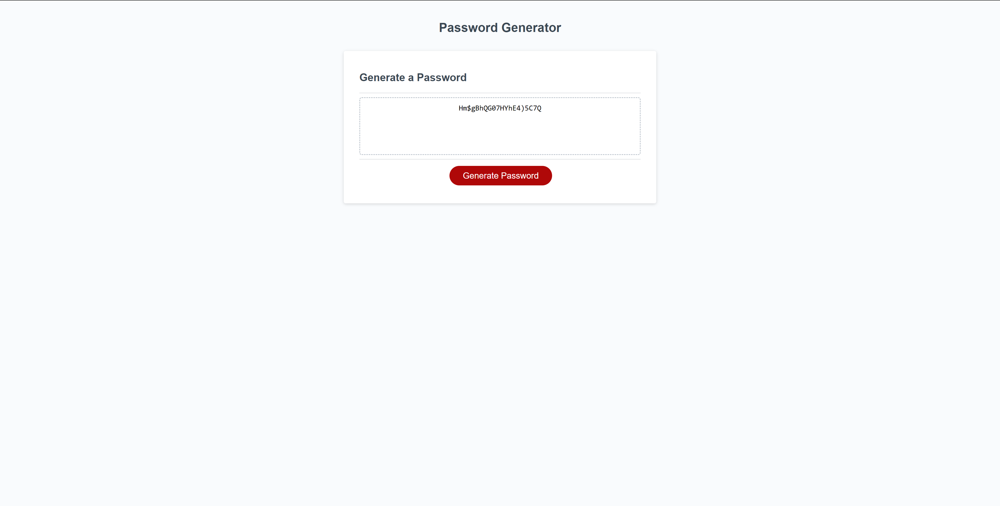

# Password-Generator-RBC

## Description
Link to deployed app: https://eldenbear.github.io/RBC-Module-3-PWGen/

This app is a Password Generator that will take in values from the user and spit out a random password for the user to use. This will help the user to obtain stronger passwords than they may have come up with themselves.
Provide a short description explaining the what, why, and how of your project. Use the following questions as a guide:

## Usage

Below is an image of the generator after it has generated a random password. You click on the generate password button then answer a prompt for the length, followed by confirming what values you'd like in your password.

